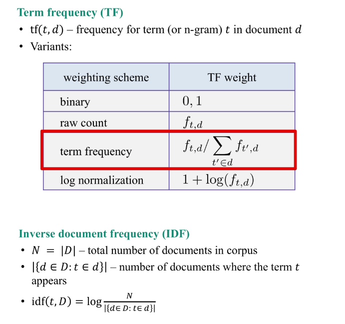

1.Choose true statements about text tokens.  
A.lemmatization needs more storage than stemmning to work 
B.Stemming can be done with heuristic rules. 
C.Lemmatization is always better than stemming. 
D.A model without stemming/lemmatization can be the best. 
 
答案：A,B,D 
 
 
2.Imagine you have a texts database. Here are stemming and lemmatization results for some of the words: 
----------------------------------------------------------------------------- 
Word                          Stem                        Lemma 
----------------------------------------------------------------------------- 
operate                       oper                       operate 
----------------------------------------------------------------------------- 
operating                     oper                       operating 
----------------------------------------------------------------------------- 
operates                      oper                       operates 
----------------------------------------------------------------------------- 
operation                     oper                       operation 
----------------------------------------------------------------------------- 
operative                     oper                       operative 
----------------------------------------------------------------------------- 
operatives                    oper                       operative 
----------------------------------------------------------------------------- 
operational                   oper                       operational 
----------------------------------------------------------------------------- 
 
Imagine you want to find results in your texts database using the folling queries: 
1.operating system(we are looking for articles about OS like Windows or Linux) 
2.operates in winter(we are looking for machines that can be operated in winter) 
 
Before execution of our search we apply either steming or lemmatization to both query 
and texts. Compare stemming and lemmatization for a givern query and choose the correct  
statements. 
 
A.Stemming provides higher recall for operates in winter query 
B.Stemming provides higher F1-score for operating system query. 
C.Lemmatization provides higher precision for operates in winter query. 
D.Stemming  provides higher precision for operating system query. 
 
答案：A,C 
 
 
3.Choose correct statements about bag-of-words (or n-grams features). 
A.For bag-of-words features you need an amount of RAM at least proportinal to 
N X T,where N is the number of documents, T is the number of unique tokens in the dataset. 
B.You get the same vectorization result for any words permutation in your text. 
C.Hashing vectorizer (object that does vectorizaiton) needs an amount of RAM. 
proportional to vocabulary size to operate. 
D.Classical bag-of-words vectorizer(object that does vectorization) needs an. 
amount of RAM at least proportional to T,which is the number of unique tokens in 
the dataset. 
E.We prefer sparse storage formats for bag-of-words features.
 
答案：D,E 
 
 

4. Let us consider the following texts: 
~good movie 
~not a good movie 
~did not like 
~i like it 
~good one 
Let us count Term Frequency here as a distribution over tokens in a particular text, 
for example for text "good one" we have TF=0.5 for "good" and "one" tokens. 

 

What is the sum of TF-IDF  values for 1-grams in "good movie" text? Enter a math 
 expression as an answer .Here's an example of a valid expression:log(1/2)*0.1. 
  
 答案： (0.5 * log(5/3))+(0.5 * log(5/2))   

 5.What models are usable on top of bag-of-words features (for 100000 words)? 
 A.Naive Bayes 
 B.Logistic Regression 
 C.SVM 
 D.Decision Tree 
 E.Gredient Boosted Trees. 

 答案：

