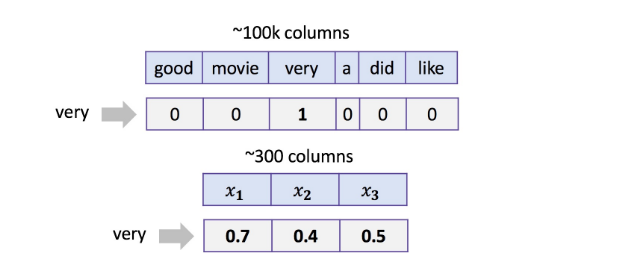
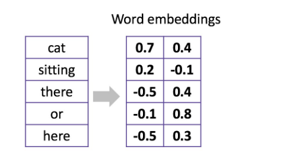

1.Let's recall how we treated words as one-hot sparse vectors in BOW and dense embeddings in neural networks. 
   
 
Choose correct statements below.
 
A.For both word representations we can take a weighted sum of vectors  
corresponding to tokens of any text to obtain good features for this  
text for further usage in linear model. The weight for any token can be  
an IDF value for that token.  
B.For both word representations we can take a sum of vectors corresponding  
to token of any text to obtain good features for this text for further  
usage in linear model.  
C.Linear model on top of a sum of neural representations can work faster  
than on top of BOW.   
D.You can replace word2vec embeddings with an random vectors to get a good  
features descriptor as a sum of vectors corresponding to all text tokens.  

答案：A，B,C   
 
2. Let's recall 1D convolution for words:
   
 
What is the result of 1D convolution + maximum pooling over time for the  
following kernel without padding?  
 
   
 

答案：

 

3.Let's recall 1D convolutions for characters. Choose correct statements .  
 
A.One 1D convolutional layer for spotting character 3-grams is enough for solving a practical task.  
B.1D convolutions for characters consume one-hot encoded vectors for characters.  
C.1D convolutions work better than BOW for huge datasets.

 
答案：B,C